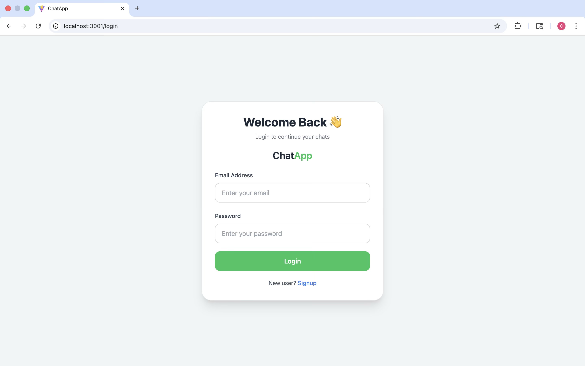
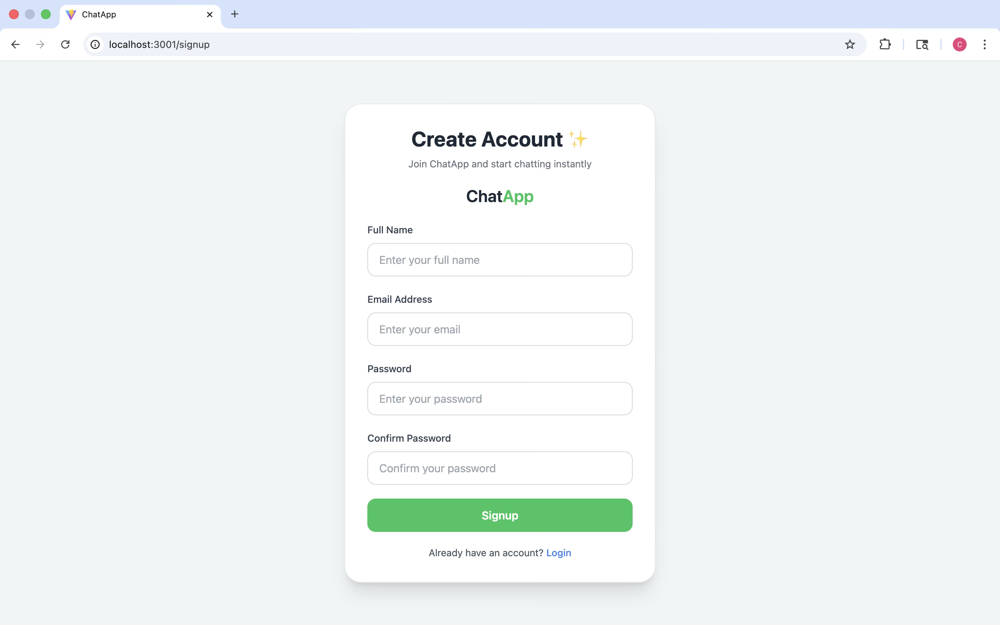
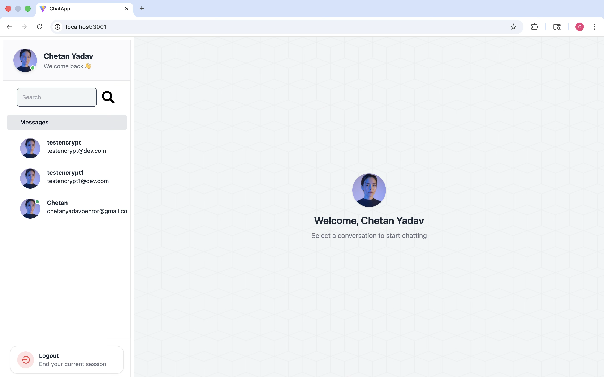
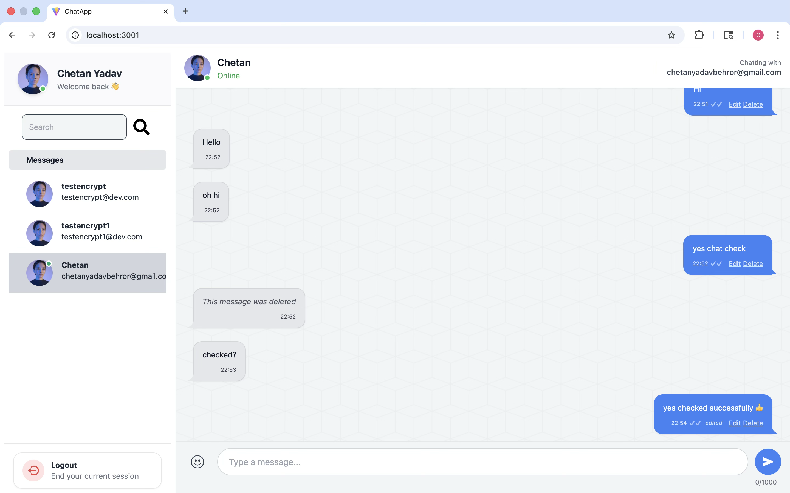

# ChatApp 💬

A full-stack real-time chat application built with the MERN stack and Socket.IO, delivering instant messaging with a focus on reliability, security, and user experience.

[](https://chatapp-j4hc.onrender.com)
[](https://github.com/chetan202022/ChatApp)

---

## 📸 Screenshots

### 🔐 Authentication

| Login | Sign Up |
|--------|---------|
|  |  |

### 💬 Chat Experience

| Home | Chat Window |
|------|-------------|
|  |  |

---

## 📋 Table of Contents

- [Features](#features)
- [Tech Stack](#tech-stack)
- [Installation](#installation)
- [Configuration](#configuration)
- [Usage](#usage)
- [Performance](#performance)
- [Authentication & Security](#authentication--security)
- [Project Structure](#project-structure)
- [Contributing](#contributing)
- [Author](#author)

---

<h2 id="features">✨ Features</h2>

- **User Authentication**: Secure registration and login with JWT tokens
- **Email Verification**: Account verification via Nodemailer integration
- **Real-Time Messaging**: Instant message delivery using Socket.IO
- **User Presence**: Live online/offline status tracking
- **Message Status**: Read receipts and message delivery indicators
- **Security**: Password hashing with bcryptjs and protected routes
- **Responsive Design**: Mobile-friendly user interface
- **Database Integration**: MongoDB Atlas with Mongoose ODM
- **Production Ready**: Deployed and maintained on Render

---

<h2 id="tech-stack">🛠️ Tech Stack</h2>

### Frontend
| Technology | Purpose |
|-----------|---------|
| React.js | UI library |
| Zustand | State management |
| Axios | HTTP client |
| Tailwind CSS | Utility-first styling |
| DaisyUI | Component library |
| Socket.IO Client | Real-time communication |

### Backend
| Technology | Purpose |
|-----------|---------|
| Node.js | Runtime environment |
| Express.js | Web framework |
| Socket.IO | WebSocket library |
| JWT | Authentication |
| bcryptjs | Password hashing |
| Nodemailer | Email service |

### Infrastructure
| Technology | Purpose |
|-----------|---------|
| MongoDB Atlas | Cloud database |
| Mongoose | ODM |
| Render | Hosting platform |

---

<h2 id="installation">⚙️ Installation</h2>

### Prerequisites

- Node.js (v14 or higher)
- npm or yarn
- MongoDB Atlas account
- Email service credentials (Gmail or equivalent)

### Clone Repository

```bash
git clone https://github.com/chetan202022/ChatApp.git
cd ChatApp
```

### Backend Setup

```bash
cd Backend
npm install
```

### Frontend Setup

```bash
cd Frontend
npm install
```

---

<h2 id="configuration">🔧 Configuration</h2>

### Environment Variables

Create a `.env` file in the `Backend` directory with the following configuration:

```env
# Server Configuration
PORT=4002
NODE_ENV=development

# Database
MONGODB_URI=your_mongodb_connection_string

# Authentication
JWT_TOKEN=your_jwt_secret_key
JWT_EXPIRE=7d

# Email Configuration
EMAIL=your_email@gmail.com
EMAIL_PASS=your_app_specific_password

# URLs
FRONTEND_URL=http://localhost:3001
BACKEND_URL=http://localhost:4002
```

**Note**: For Gmail, use [App Passwords](https://support.google.com/accounts/answer/185833) instead of your regular password.

---

<h2 id="usage">🚀 Usage</h2>

### Start Backend Server

```bash
cd Backend
npm run dev
```

The backend will start on `http://localhost:4002`

### Start Frontend Development Server

```bash
cd Frontend
npm run dev
```

The frontend will be available at `http://localhost:3001`

### Production Build

**Frontend:**
```bash
npm run build
```

**Backend:**
```bash
npm run start
```

---

<h2 id="performance">📊 Performance</h2>

Performance testing conducted using Apache JMeter and Artillery demonstrates robust scalability:

| Metric | Result |
|--------|--------|
| **Concurrent Socket.IO Connections** | 6000+ |
| **API Throughput** | 3.7 req/sec → 51+ req/sec |
| **Average Response Time** | 2.1s → 2ms |
| **Messaging Latency** | Low latency, real-time delivery |

---

<h2 id="authentication--security">🔐 Authentication & Security</h2>

### Authentication Flow

1. User creates an account
2. Verification email is sent to the registered email address
3. User verifies account through email verification link
4. JWT token is issued upon successful verification
5. Authenticated users access protected routes
6. Real-time socket connection established for messaging

### Security Features

- **JWT-based authentication** for stateless security
- **bcryptjs** for secure password hashing
- **Protected routes** preventing unauthorized access
- **Email verification** to ensure valid user identities
- **HTTP-only cookies** for token storage (production)

---

<h2 id="project-structure">📁 Project Structure</h2>

```
ChatApp/
├── Backend/
│   ├── models/
│   ├── routes/
│   ├── controllers/
│   ├── middleware/
│   ├── config/
│   └── server.js
├── Frontend/
│   ├── src/
│   │   ├── components/
│   │   ├── pages/
│   │   ├── store/
│   │   ├── utils/
│   │   └── App.jsx
│   └── public/
└── README.md
```

---

<h2 id="contributing">🤝 Contributing</h2>

Contributions are welcome! To contribute:

1. Fork the repository
2. Create a feature branch (`git checkout -b feature/AmazingFeature`)
3. Commit your changes (`git commit -m 'Add some AmazingFeature'`)
4. Push to the branch (`git push origin feature/AmazingFeature`)
5. Open a Pull Request

---

<h2 id="author">👨‍💻 Author</h2>

# Chetan Yadav

<p>
<a href="https://github.com/chetan202022">

</a>

<a href="https://linkedin.com/in/chetan-yadav-a21b0a289">

</a>

<a href="https://leetcode.com/u/Chetan__10/">

</a>
</p>

---

## ⭐ Support

If you found this project helpful, please consider:

- Giving it a ⭐ on GitHub
- Sharing it with others
- Providing feedback or suggestions

---